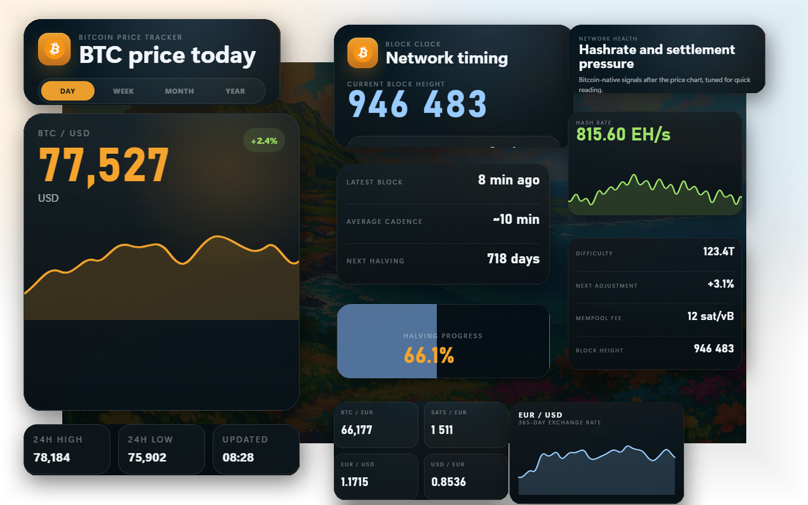

<p align="center">
  
</p>

<h1 align="center">Bitcoin Block Clock</h1>

<p align="center">
  A Bitcoin dashboard for live price, block height, fee pressure, hashrate, and halving progress.
</p>

<p align="center">
  <a href="https://github.com/patriceac/BitcoinBlockClock/releases/latest/download/BitcoinBlockClock-Windows-Setup.exe"></a>
  <a href="https://github.com/patriceac/BitcoinBlockClock/releases/latest/download/BitcoinBlockClock-macOS.dmg"></a>
  <a href="https://github.com/patriceac/BitcoinBlockClock/releases/latest/download/BitcoinBlockClock-Linux.AppImage"></a>
  <a href="https://github.com/patriceac/BitcoinBlockClock/releases/latest/download/BitcoinBlockClock-Android.apk"></a>
</p>

<p align="center">
  <a href="https://github.com/patriceac/BitcoinBlockClock/releases/latest">Latest release</a>
  ·
  <a href="app/src/main/assets/clock.html">Clock source</a>
  ·
  <a href="https://github.com/patriceac/BitcoinBlockClock/actions/workflows/release-installers.yml">Installer workflow</a>
</p>



## Install

| Platform | Download | Notes |
| --- | --- | --- |
| Windows | [BitcoinBlockClock-Windows-Setup.exe](https://github.com/patriceac/BitcoinBlockClock/releases/latest/download/BitcoinBlockClock-Windows-Setup.exe) | Standard setup installer with repaired Start at Login registration. |
| Windows portable | [BitcoinBlockClock-Windows-Portable.exe](https://github.com/patriceac/BitcoinBlockClock/releases/latest/download/BitcoinBlockClock-Windows-Portable.exe) | Rebuilt portable Windows executable that runs without installation. |
| macOS | [BitcoinBlockClock-macOS.dmg](https://github.com/patriceac/BitcoinBlockClock/releases/latest/download/BitcoinBlockClock-macOS.dmg) | Drag-and-drop desktop package. |
| Linux | [BitcoinBlockClock-Linux.AppImage](https://github.com/patriceac/BitcoinBlockClock/releases/latest/download/BitcoinBlockClock-Linux.AppImage) | Portable Linux build. |
| Linux package | [BitcoinBlockClock-Linux.deb](https://github.com/patriceac/BitcoinBlockClock/releases/latest/download/BitcoinBlockClock-Linux.deb) | Debian/Ubuntu package. |
| Android | [BitcoinBlockClock-Android.apk](https://github.com/patriceac/BitcoinBlockClock/releases/latest/download/BitcoinBlockClock-Android.apk) | Release-mode APK for sideloading. |

The latest GitHub release includes the rebuilt Windows installer and portable Windows executable. The Windows Start at Login option repairs stale startup entries so Windows launches the installed app at sign-in.

Release installers and the Android APK are attached to GitHub releases. The workflow builds desktop artifacts with Electron Builder and the Android APK with Gradle's `assembleRelease` task.

The Android APK is a release-mode sideload build. Configure production signing before using it for app-store distribution.

## What It Shows

- Live BTC price with recent market context.
- Current block height and block timing.
- Fee pressure and mempool-oriented network signals.
- Hashrate and difficulty data.
- Halving progress in a glanceable display.

## Run Locally

Serve the shared clock asset in a browser:

```powershell
.\serve-browser.ps1
```

Launch the Electron wrapper:

```powershell
npm run electron
```

## Build

Install JavaScript dependencies:

```powershell
npm install
```

Build desktop installers for the current platform:

```powershell
npm run build:electron
```

Build the Windows release installers locally:

```powershell
npm run build:electron:win
```

Android release APK:

```powershell
.\gradlew.bat assembleRelease
```

Cross-platform desktop releases and the Android APK are produced by the [release installers workflow](https://github.com/patriceac/BitcoinBlockClock/actions/workflows/release-installers.yml) when a `v*` tag is pushed or the workflow is run manually with a release tag.
